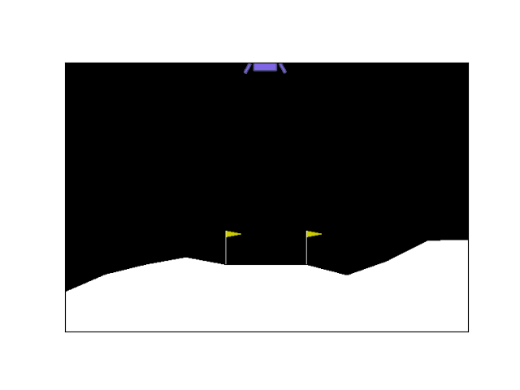

# DRL

Modified PyTorch Tutorial for Study   
https://pytorch.org/tutorials/intermediate/reinforcement_q_learning.html   

21-06-02   
DQN, Double DQN, Dueling DQN (Need modulize)   
   
21-07-21   
DDPG   

