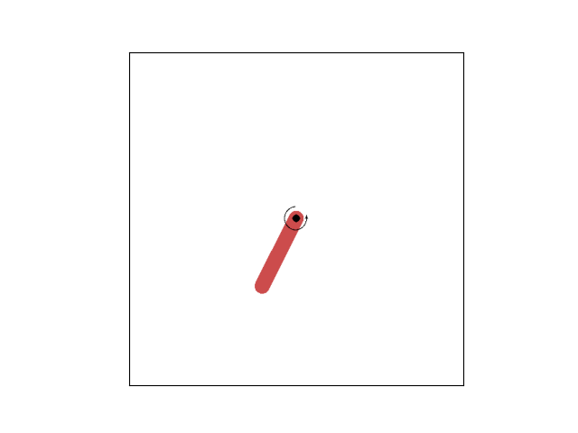
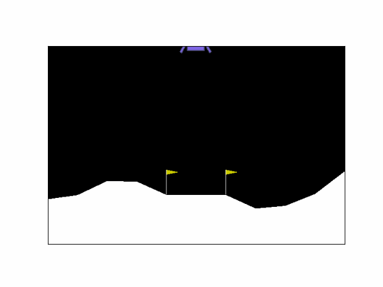

# DRL

Modified PyTorch Deep Reinforcement Learning Tutorial for Study   
https://pytorch.org/tutorials/intermediate/reinforcement_q_learning.html   

21-06-02   
DQN, Double DQN, Dueling DQN   
   
21-07-21   
DDPG   

   
   
21-07-28   
DDPG with CNN(continuous control from pixel)   
agent observation   

